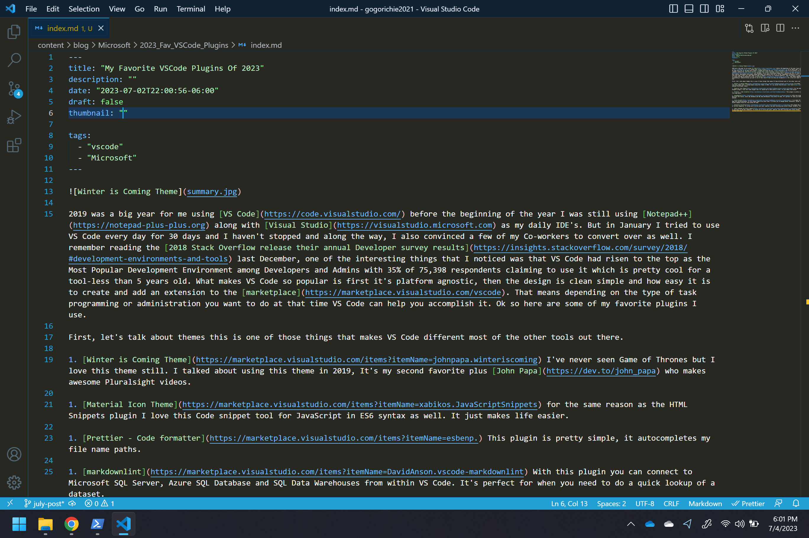

I wrote my orginal post back in 2019 and i'm still running [VS Code](https://code.visualstudio.com/) in 2023 everyday now i'm using it for both for my home and work IDE needs primarly. Reading the [2023 Stack Overflow release their annual Developer survey results](https://survey.stackoverflow.co/2023/#most-popular-technologies-language-learn) seems like i'm not alone as it still ranks as the Most Popular Development Environment among Developers and Admins with 73% of 86,544 respondents claiming to use it. This time i want to talk about how i use the tool at home.

First, let's talk about theme i'm using last time talked using Yonce and now i've to using the Winter is Coming Theme.

1. [Winter is Coming Theme](https://marketplace.visualstudio.com/items?itemName=johnpapa.winteriscoming) I've never seen Game of Thrones but I love this theme still. I talked about using this theme in 2019 and still using it.

1. [Material Icon Theme](https://marketplace.visualstudio.com/items?itemName=xabikos.JavaScriptSnippets).

1. [Prettier - Code formatter](https://marketplace.visualstudio.com/items?itemName=esbenp.) This plugin is pretty simple, it autocompletes my file name paths.

1. [markdownlint](https://marketplace.visualstudio.com/items?itemName=DavidAnson.vscode-markdownlint).

1. [Azure Account](https://marketplace.visualstudio.com/items?itemName=ms-azuretools.vscode-docker), I run about 10 containers on my laptop for demo and testing purposes. So this plugin might be my most used. It allows you to manage Docker Containers, Docker Images, Dockerfile, and docker-compose files all from within VS Code.

1. [HashiCorp Terraform](https://marketplace.visualstudio.com/items?itemName=sneezry.vscode-devto).

1. [Hugo Language and Syntax Support](https://marketplace.visualstudio.com/items?itemName=sneezry.vscode-devto).
