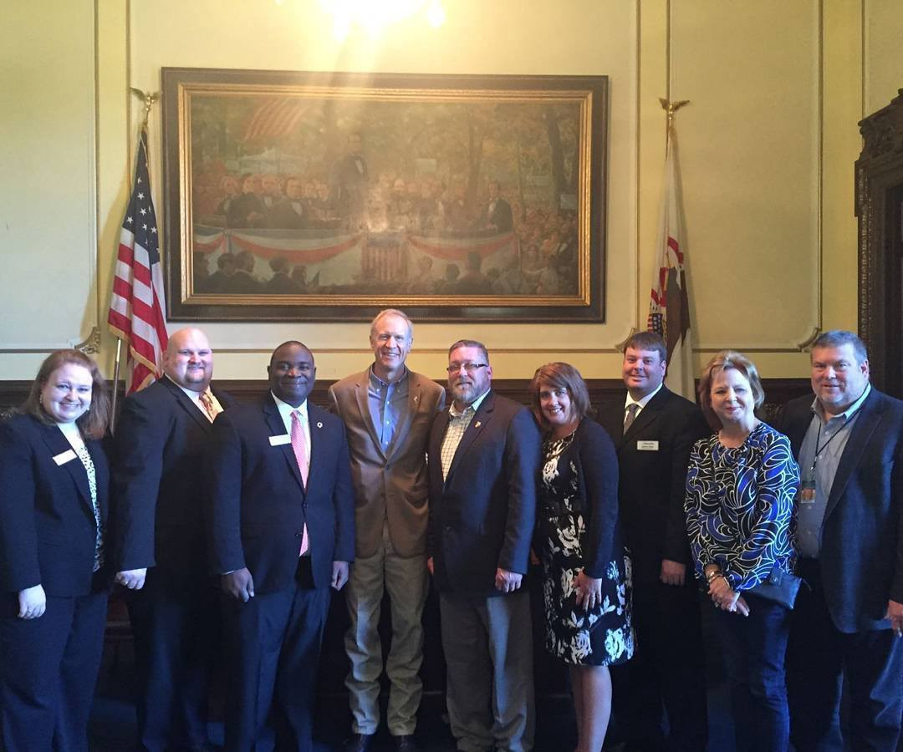

The second week of October annually is Jaycee Week, it's the week where we as Jaycees celebrate the founding of our organization in 1915 by Henry Giessenbier Jr. Ironically this month marks my 14th year as a member. So what better time of the year than now to share with you why I Jaycee? I joined the Jaycees to help make my community a better place. But I stay a Jaycee because it gives me the opportunity to be a Young Active Citizen, who can create positive change within my community. What's the difference? Well making my community a better place is about helping my fellow-man or women with their need and creating positive change in my community is about fixing the root cause that is causing hardship to my fellow-man or women. This is one of the most important things the Jaycees have taught me and have given me the ability to do. Most of the time people tackle problems with a one-time donation or one day of volunteer work, but as Jaycees, we focus on making a sustainable impact.

Second I Jaycee till this day because it gives me the better opportunity to be a better leader. Since I was Chapter President back in 2005 each year as a member I've become a better leader and In 2016 I served as the leader of the Illinois Jaycees, the largest Jaycee membership state in the nation. Being an effective leader is a universal skill and not everyone can master but the Jaycee organization gives me the opportunity to be a great one and these skills are applicable outside the organization. John F. Kennedy credited the Junior Chamber with providing his 'informal' education, which he considered equally important as his Harvard 'formal' education.

Finally, I Jaycee because it gives me the opportunity to meet amazing people and see new amazing places around the world. In this great organization, I had the ability to meet some really awesome people, make some amazing lifelong friends, and meet my wife.